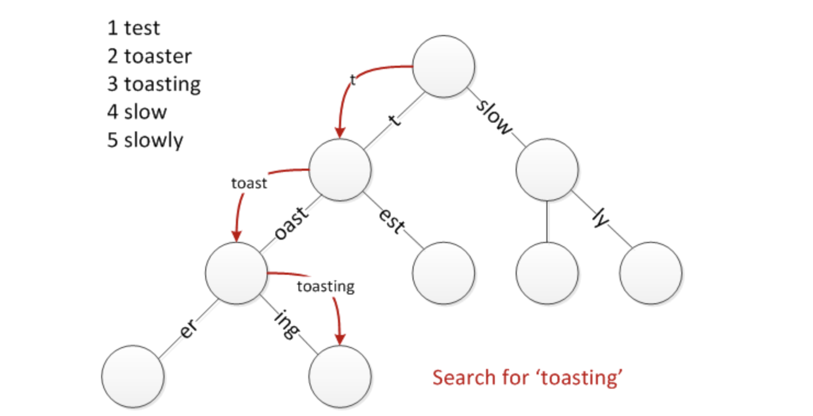

# fasthttp及httprouter库优化部分解读

fasthttp 是 Go 的一款不同于标准库 net/http 的 HTTP 实现

- 协程池
- 对象的复用, sync.Pool
- 减少 []byte 到 string 的转化
- 延迟解析 HTTP 请求中的数据

## 区别

#### 入口

* net/http

```golang
func Index(w http.ResponseWriter, r *http.Request) {
    w.Write([]byte("hello world"))
}

func main() {
    router := httprouter.New()
    router.GET("/", Index)

    log.Fatal(http.ListenAndServe(":8080", router))
}
```

* fasthttp

```golang
import (
    "github.com/buaazp/fasthttprouter"
    "github.com/valyala/fasthttp"
)

func Index(ctx *fasthttp.RequestCtx) {
    ctx.WriteString("hello world")
}

func main() {
    router := fasthttprouter.New()
    router.GET("/", Index)

    log.Fatal(fasthttp.ListenAndServe(":8080", Index))
}}
```

#### server处理函数对比

* net/http 原生server.go

```golang
l := listen()
func (srv *Server) Serve(l net.Listener) error {
    for {
        rw, err := l.accept()
        ....
        // 处理请求, 每次都开启一个 gorotine
        go c.serve(ctx)
    }
}
```

* fasthttp 的 Serve

```golang
func (s *Server) Serve(ln net.Listener) error {
    // 初始化工作池
    wp := &workerPool{
        // ...
    }
    // ...
    for {
    if c, err = acceptConn(s, ln, &lastPerIPErrorTime); err != nil {
        ......
    }
    // 通过channel发送给对应的worker
    if !wp.Serve(c) {
        //......
    }
    //......
    }
}
```

## bytebufferpool

#### 解决的问题

- 初始化byte对象是默认的长度, 减少后续操作对byte切片底层数组的扩容操作及浪费问题

#### 使用

```golang
import "github.com/valyala/bytebufferpool"

func main() {
    bb := bytebufferpool.Get()

    bb.Write([]byte("second"))
    bb.B = append(bb.B, "third"...)

    bytebufferpool.Put(bb)
}
```

#### Pool结构体

```golang
type Pool struct {
    calls       [steps]uint64 // 记录不同长度byte被调用的次数
    calibrating uint64        // 校准锁

    defaultSize uint64 // 被调用最多的byte长度
    maxSize     uint64 // 保存的最大长度

    pool sync.Pool
}
```

#### Get函数入口

```golang
var defaultPool Pool

func Get() *ByteBuffer { return defaultPool.Get() }

func (p *Pool) Get() *ByteBuffer {
    v := p.pool.Get()
    if v != nil {
        return v.(*ByteBuffer)
    }
    return &ByteBuffer{
        // 默认byte长度被调用最多次
        B: make([]byte, 0, atomic.LoadUint64(&p.defaultSize)),
    }
}
```

#### Put函数入口

```golang
func Put(b *ByteBuffer) { defaultPool.Put(b) }

func (p *Pool) Put(b *ByteBuffer) {
    // 根据byte长度获取索引
    idx := index(len(b.B))

    // 当某个槽中的个数大于42000时，重新校准
    if atomic.AddUint64(&p.calls[idx], 1) > calibrateCallsThreshold {
        p.calibrate()
    }

    maxSize := int(atomic.LoadUint64(&p.maxSize))
    // 只有小于maxSize的byte对象才放回对象池
    if maxSize == 0 || cap(b.B) <= maxSize {
        b.Reset()
        p.pool.Put(b)
    }
}
```

#### 校准函数

```golang
func (p *Pool) calibrate() {
    // 锁
    if !atomic.CompareAndSwapUint64(&p.calibrating, 0, 1) {
        return
    }

    // callSizes 缓存
    a := make(callSizes, 0, steps)
    var callsSum uint64 // 记录一共被调用次数
    for i := uint64(0); i < steps; i++ {
        calls := atomic.SwapUint64(&p.calls[i], 0)
        callsSum += calls
        // 记录p.calls
        a = append(a, callSize{
            calls: calls,
            size:  minSize << i,
        })
    }
    sort.Sort(a) // 根据调用次数从大到小排列

    defaultSize := a[0].size
    maxSize := defaultSize

    // 最大调用值取95%
    maxSum := uint64(float64(callsSum) * maxPercentile)
    callsSum = 0

    // 循环callSizes, 获取size最大值
    for i := 0; i < steps; i++ {
        if callsSum > maxSum {
            break
        }
        callsSum += a[i].calls
        size := a[i].size
        if size > maxSize {
            maxSize = size
        }
    }

    atomic.StoreUint64(&p.defaultSize, defaultSize)
    atomic.StoreUint64(&p.maxSize, maxSize)

    // 解锁
    atomic.StoreUint64(&p.calibrating, 0)
}
```

## string与[]byte


#### 底层结构

```golang
// string
type stringStruct struct {
    str unsafe.Pointer
    len int
}

// []byte
type slice struct {
    array unsafe.Pointer
    len   int
    cap   int
}
```

#### 相互装换

```golang

// string转[]byte
func stringtoslicebyte(buf *tmpBuf, s string) []byte {
	var b []byte
	if buf != nil && len(s) <= len(buf) {
		*buf = tmpBuf{}
		b = buf[:len(s)]
	} else {
		b = rawbyteslice(len(s))
	}
	copy(b, s)
	return b
}

// []byte转string
func slicebytetostring(buf *tmpBuf, b []byte) (str string) {
	l := len(b)
	if l == 0 {
		return ""
	}
	if l == 1 {
		stringStructOf(&str).str = unsafe.Pointer(&staticbytes[b[0]])
		stringStructOf(&str).len = 1
		return
	}
	var p unsafe.Pointer
	if buf != nil && len(b) <= len(buf) {
		p = unsafe.Pointer(buf)
	} else {
		p = mallocgc(uintptr(len(b)), nil, false)
	}
	stringStructOf(&str).str = p
	stringStructOf(&str).len = len(b)
	memmove(p, (*(*slice)(unsafe.Pointer(&b))).array, uintptr(len(b)))
	return
}
```

#### 无需拷贝(不建议使用)

```golang
type SliceHeader struct {
    Data unsafe.Pointer
    Len  int
    Cap  int
}

type StringHeader struct {
    Data unsafe.Pointer
    Len  int
}

func String2ByteSlice(str string) (bs []byte) {
    strHdr := (*StringHeader)(unsafe.Pointer(&str))
    sliceHdr := (*SliceHeader)(unsafe.Pointer(&bs))
    sliceHdr.Data = strHdr.Data
    sliceHdr.Len = strHdr.Len
    sliceHdr.Cap = strHdr.Len
    return
}

func str2btes(s string) []byte {
    x := (*[2]uintptr)(unsafe.Pointer(&s))
    h := [3]uintptr{x[0], x[1], x[1]}
    return *(*[]byte)(unsafe.Pointer(&h))
}

func bytes2str(b []byte) string {
    return *(*string)(unsafe.Pointer(&b))
}
```

## httprouter

#### 压缩前缀树 radix tree



#### 路径示例

```golang
router := httprouter.New()
router.GET("/search", Index)
router.GET("/support", Index)
router.GET("/blog/:post", Index)

----------------------
{/search, 0x1264030}
----------------------
{/s, <nil>}
{earch, 0x1264030}	{upport, 0x1264030}
----------------------
{/, <nil>}
{s, <nil>}	blog/, <nil>}
{earch, 0x1264030}	{upport, 0x1264030}	{:post, 0x1264030}
```

#### Router结构体

```golang
type Router struct {
    // 每个http方法对应一个基数树
    trees map[string]*node
    // ...
}
```

#### Router.Handle函数, 注册路径及相关处理函数到node中

```golang
func (r *Router) Handle(method, path string, handle Handle) {
    // ...
    root := r.trees[method]
    if root == nil {
        root = new(node)
        r.trees[method] = root

        r.globalAllowed = r.allowed("*", "")
    }

    // 注册函数
    root.addRoute(path, handle)
    // ...
}
```

#### 基数树结构体

```golang
type node struct {
    path      string   // 节点对应的path
    indices   string   // 子节点path首字母
    wildChild bool     // 子节点是否为参数节点 包含* :
    nType     nodeType // 节点类型
    priority  uint32   // 节点权重， 子节点的handler总数
    children  []*node  // 子节点
    handle    Handle   // 节点对应函数
}
```

#### node.addRoute函数

```golang
func (n *node) addRoute(path string, handle Handle) {
    fullPath := path
    // 权重加1
    n.priority++

    // 首次添加跟节点
    if len(n.path) == 0 && len(n.indices) == 0 {
        n.insertChild(path, fullPath, handle)
        n.nType = root
        return
    }

walk:
    for {
        // 获取最长公共前缀索引值
        i := longestCommonPrefix(path, n.path)

        // 如果公共前缀小于当前path，则需要切分
        if i < len(n.path) {
            // 把该节点设置为孩子节点
            child := node{
                path:      n.path[i:],
                wildChild: n.wildChild,
                nType:     static,
                indices:   n.indices,
                children:  n.children,
                handle:    n.handle,
                priority:  n.priority - 1,
            }

            // 设置当前节点
            n.children = []*node{&child}
            n.indices = string([]byte{n.path[i]})
            n.path = path[:i]
            n.handle = nil
            n.wildChild = false
        }

        // 公共节点小于参数path
        if i < len(path) {
            path = path[i:]

            idxc := path[0]

            for i, c := range []byte(n.indices) {
                if c == idxc {
                    i = n.incrementChildPrio(i)
                    n = n.children[i]
                    continue walk
                }
            }

            // Otherwise insert it
            if idxc != ':' && idxc != '*' {
                // []byte for proper unicode char conversion, see #65
                n.indices += string([]byte{idxc})
                child := &node{}
                n.children = append(n.children, child)
                n.incrementChildPrio(len(n.indices) - 1)
                n = child
            }
            n.insertChild(path, fullPath, handle)
            return
        }

        // Otherwise add handle to current node
        if n.handle != nil {
            panic("a handle is already registered for path '" + fullPath + "'")
        }
        n.handle = handle
        return
    }
}
```

#### node.getValue函数

```golang
func (n *node) getValue(path string, params func() *Params) (handle Handle, ps *Params, tsr bool) {

walk:
    for {
        prefix := n.path
        if len(path) > len(prefix) {
            // 只有包含当前path, 才继续
            if path[:len(prefix)] == prefix {
                path = path[len(prefix):]

                // 如果子节点不是参数节点
                if !n.wildChild {
                    idxc := path[0]
                    // 持续先下寻找
                    for i, c := range []byte(n.indices) {
                        if c == idxc {
                            n = n.children[i]
                            continue walk
                        }
                    }

                    tsr = (path == "/" && n.handle != nil)
                    return
                }

                // 如果是参数节点，则只有一个子节点
                n = n.children[0]
                switch n.nType {
                case param:
                    // Find param end (either '/' or path end)
                    end := 0
                    for end < len(path) && path[end] != '/' {
                        end++
                    }

                    // 找到一个参数
                    if params != nil {
                        if ps == nil {
                            // 初始化参数列表
                            ps = params()
                        }
                        i := len(*ps)
                        *ps = (*ps)[:i+1]
                        (*ps)[i] = Param{
                            Key:   n.path[1:],
                            Value: path[:end],
                        }
                    }

                    // 路径大于参数节点, 且有子节点， 则继续先下
                    if end < len(path) {
                        if len(n.children) > 0 {
                            path = path[end:]
                            n = n.children[0]
                            continue walk
                        }
                        return
                    }

                    // 找到对应的节点， 返回对应的函数
                    if handle = n.handle; handle != nil {
                        return
                    }
                    return
                default:
                    panic("invalid node type")
                }
            }
        } else if path == prefix {
            if handle = n.handle; handle != nil {
                return
            }
        }
    }
}
```
